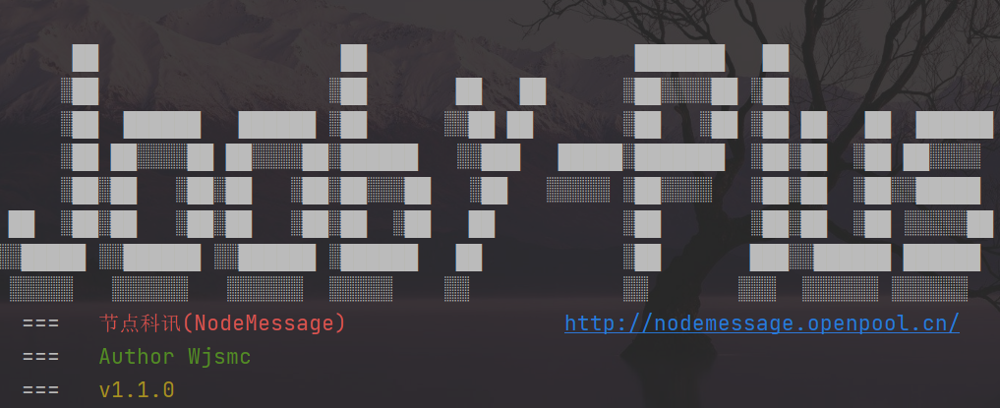

# Jooby-plus

**v1.1.0**


#### 介绍

**Jooby-plus**是开源框架Jooby的精简版，提供了自动配置与注入功能，助你快速进入开发状态。

MVN:https://repo.maven.apache.org/maven2/com/nodemessage/jooby/



#### 软件架构
* jooby-plus

  =	jooby-plus-starter-parent

  ​	==	jooby-plus-starter-web

  ​	==	jooby-plus-starter-mybatis

  ​	== 	jooby-plus-starter-redis


#### 使用教程

暂时支持使用maven引入

* 可引入parent统一版本支持

  ```xml
  <parent>
          <groupId>com.nodemessage.jooby</groupId>
          <artifactId>jooby-plus-starter-parent</artifactId>
          <version>1.1.0</version>
  </parent>
  ```

* 启动Web容器所需依赖

  ```xml
  <dependencies>
       <dependency>
           <groupId>com.nodemessage.jooby</groupId>
           <artifactId>jooby-plus-starter-web</artifactId>
       </dependency>
  </dependencies>
  ```

* 默认使用undertow服务器，可自主切换

  ```xml
     <dependencies>
          <dependency>
              <groupId>com.nodemessage.jooby</groupId>
              <artifactId>jooby-plus-starter-web</artifactId>
              <exclusions>
                  <exclusion>
                      <groupId>io.jooby</groupId>
                      <artifactId>jooby-utow</artifactId>
                  </exclusion>
              </exclusions>
          </dependency>
          <dependency>
              <groupId>io.jooby</groupId>
              <artifactId>jooby-netty</artifactId>
              <type>jar</type>
          </dependency>
      </dependencies>
  ```

* 编写启动类

  ```java
  @JoobyPlusStarter
  public class Test {
      public static void main(String[] args) {
          JoobyStarter.run(args, Test.class);
      }
  }
  ```

#### 使用说明

1. Jooby-Plus只做封装，未改动原有特性，详情参照[Jooby官网](https://jooby.io/)进行。

2. resource目录配置文件application.conf

   ```properties
   # Application configuration file. See https://github.com/typesafehub/config/blob/master/HOCON.md for more details
   server.port=1234
   ```

3. resource目录logback.xml

   ```properties
   <?xml version="1.0" encoding="UTF-8"?>
   <configuration scan="true" scanPeriod="15 seconds" debug="false">
     <appender name="STDOUT" class="ch.qos.logback.core.ConsoleAppender">
       <encoder>
         <pattern>[%d{ISO8601}]-[%thread] %-5level %logger - %msg%n</pattern>
       </encoder>
     </appender>
   
     <root level="INFO">
       <appender-ref ref="STDOUT" />
     </root>
   </configuration>
   ```

4. 编写第一个接口

   ```java
   @Controller("test")
   public class ControllerTest extends Jooby {
       {
           get("/test", ctx -> "test");
       }
   }
   
   @Path("/tes")
   public class ControllerTes {
       @GET("/tes")
       public String tes(){
           return "tes";
       }
   }
   ```

5. 配置Web容器，实现WebConfig类，通过@Component注入容器

   ```java
   @Component
   public class Config implements WebConfig {
       @Override
       public void defaultConfig(Jooby jooby) {
           fastSetting(jooby)
                   .enableGracefulShutdown()
                   .enableAccessLog()
                   .addErrorGlobal((ctx, cause, code) -> {
                       ctx.render("error");
                   });
       }
   }
   ```

#### 参与贡献

1.  Fork 本仓库
2.  新建 Feat_xxx 分支
3.  提交代码
4.  新建 Pull Request


#### 结束

**节点科讯（NodeMEssage）**官网 http://nodemessage.openpool.cn/